<p align="center">
  
</p>

<h1 align="center">Aurora</h1>

<p align="center"><b>Offline-first knowledge base for a residential rehabilitation centre</b></p>

<p align="center">
  <a href="https://kleerohere.github.io/Aurora/"><b>▶ Live demo</b></a>
  — runs entirely in your browser: the database seeds itself on first load.<br/>
  Sign in as <code>Alex</code>, <code>Sam</code> or <code>Robin</code>, password <code>aurora</code>.
</p>

<p align="center">
  <a href="https://github.com/KleeroHere/Aurora/actions/workflows/ci.yml"></a>
  
  
  
  
</p>

A desktop knowledge base for the staff of a residential recovery programme:
protocols, printable forms, shift journals and training videos, on machines
that must keep working when the network does not. Ships as one Windows
installer, stores everything locally, and syncs between machines through any
CouchDB server — when one happens to be reachable.

> **This is a demo build.** The engine is the one running in production at a
> real centre; all of its content, branding and credentials have been removed
> and replaced with a fictional handbook written for this demo. No real
> organisation, person, protocol or record appears here.

| The handbook | A film session, carried as first-class material |
| --- | --- |
| 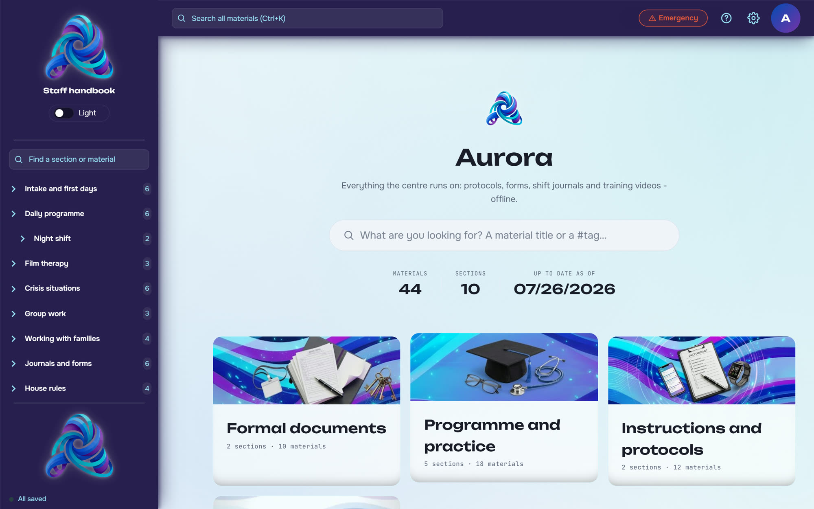 | 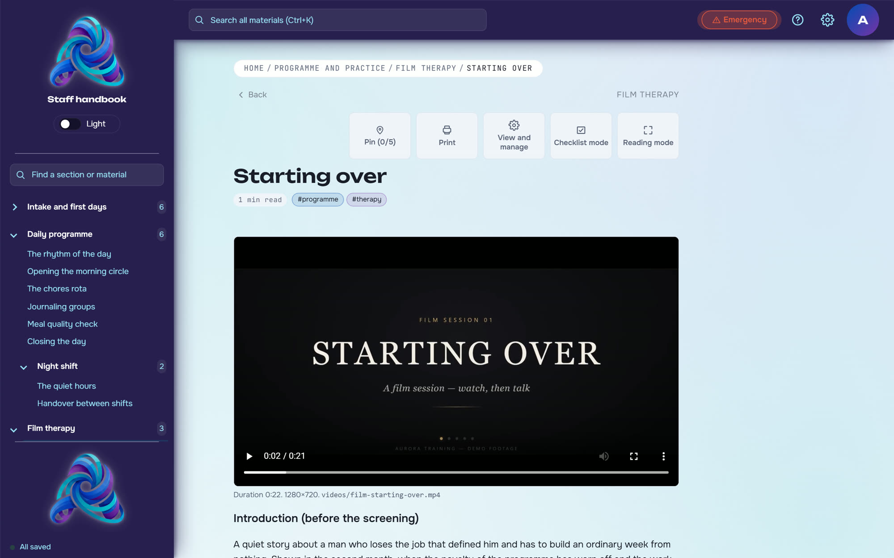 |
| **A protocol with its inline diagram** | **The same protocol carries its training video** |
| 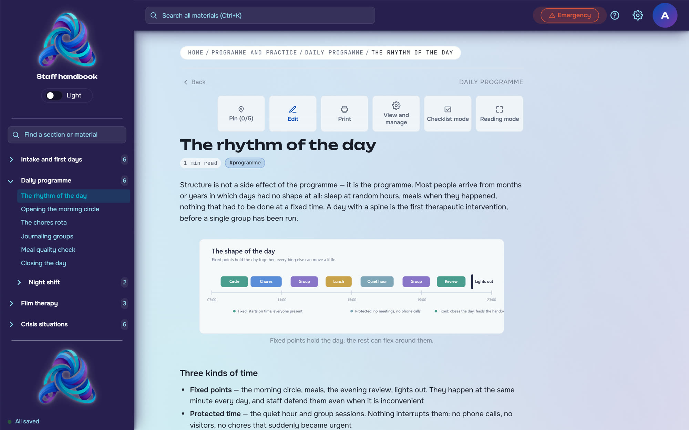 | 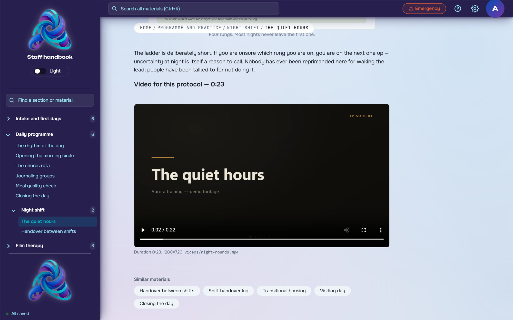 |
| **Forms are generated, multi-page, print-ready** | **Every form card shows its real first page** |
| 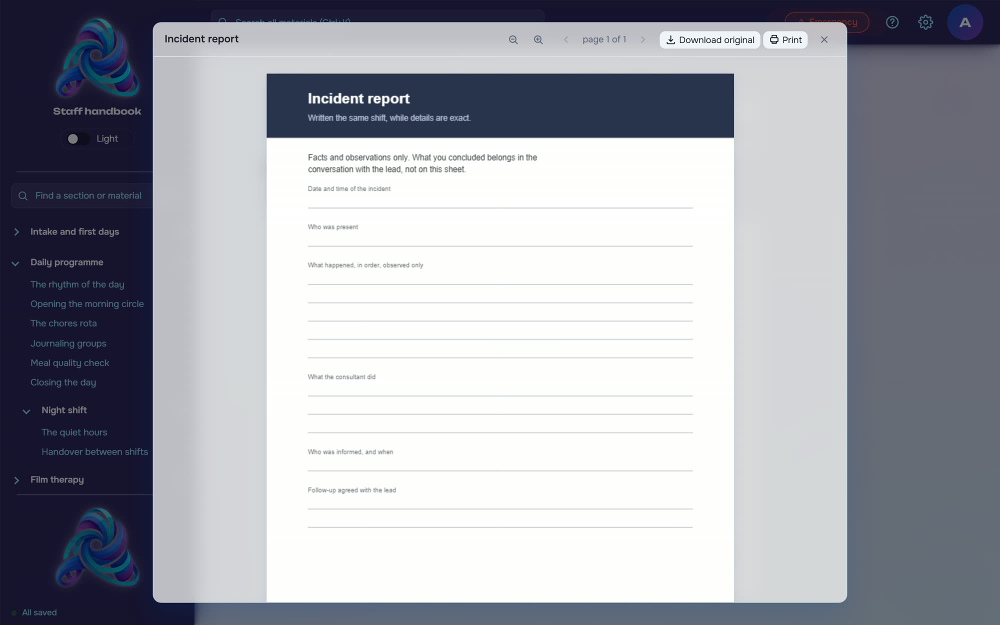 | 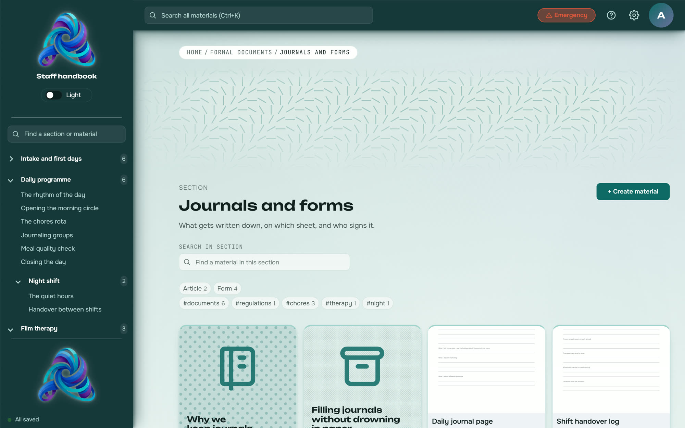 |
| **Night-shift palette, emergency protocol** | **Three palettes × light/dark, per account** |
| 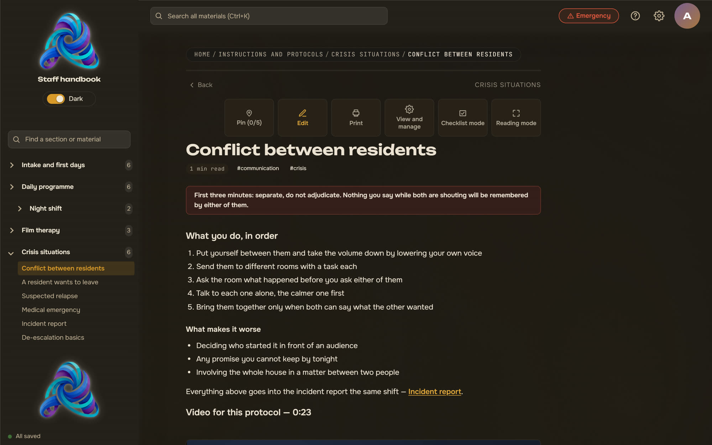 | 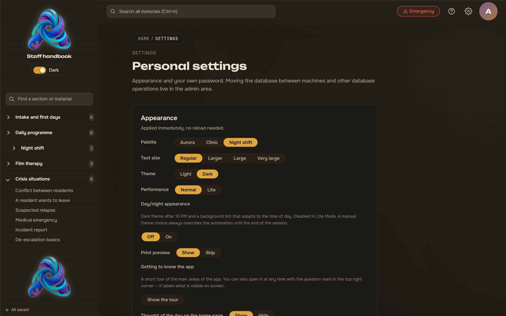 |

<p align="center">
  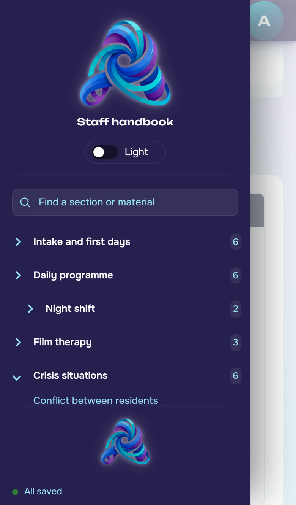
  &nbsp;&nbsp;
  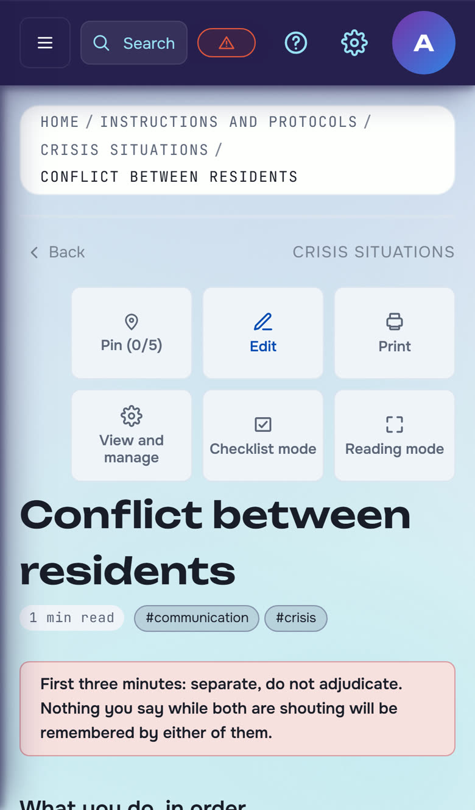
  <br/><sub>The same build is responsive: on a phone the sidebar becomes a drawer and every screen — protocols, forms, video, the editor — fits the width.</sub>
</p>

## The domain, and why it shapes everything

Rehabilitation centres are an unusual software environment. Almost every
decision in this codebase traces back to one of these facts:

- **The people using it are not at a desk.** A consultant opens the app during
  a conflict between residents, at three in the morning, on a shared machine in
  the office. Search answers from one keystroke (`Ctrl+K`), and the crisis
  protocols have a dedicated one-click **emergency mode** that darkens the
  interface and jumps straight to them.
- **Staff turnover is high and training is continuous.** The same protocol has
  to serve a five-year veteran as a reference and a second-shift newcomer as a
  lesson — hence training **videos attached to the protocol itself**, and
  film-therapy sessions carried as a material type of their own, with
  discussion questions.
- **Paper is not optional.** Handover logs, incident reports, food registers
  exist on paper because that is what regulators and night shifts actually use.
  The app keeps the master copy, generates the printable PDF, and ships
  **print-ready figures** — tables, pyramids and card sets drawn to fit one
  sheet in the right orientation.
- **The building has bad internet, and sometimes none.** Everything — search,
  editing, printing, video playback — works with the cable unplugged. External
  resources (fonts, images, CDNs) are forbidden by CSP; the app never phones
  home.
- **Nobody administers it.** There is no IT department behind these machines.
  Sync is a button, not a daemon; a missing server is a normal state with a
  plain-language explanation, not an error dialog; updates are signed and
  offered, never forced.
- **Shift work runs day and night.** The interface has a night-shift palette
  with low glare and an automatic evening dimming, because the same screen is
  read at 9 a.m. in daylight and at 4 a.m. in a dark office.

## What it does

**Material and structure**

- Four material types: **articles** (block editor), **forms** and
  **presentations** (original file + generated PDF, cover taken from the real
  first page), and **films** (intro plus discussion questions).
- Sections and sub-sections with list, grid and carousel layouts, grouped into
  four macro-categories on the home screen.
- Tags with a canonical colour scheme, tag pages, related-material suggestions,
  and a pinned shelf of up to five materials per user.
- Cross-links between materials, inserted from a picker inside the editor —
  the demo handbook is threaded with them.

**Editing**

- Editor.js block editor: headings, paragraphs, ordered/unordered/**checklist**
  lists, quotes, `warning` and `danger` callouts, tables, images and file
  attachments.
- Autosave plus `Ctrl+S`, orphaned-attachment cleanup on save, a free-form tag
  editor with autocomplete, and a change timeline per material.
- Checklist mode while reading: tick items off any list without editing the
  page — like a paper form, but the marks stay yours.

**Finding things**

- Full-text search with stemming, typo tolerance scaled to word length, prefix
  matching as you type, and a domain synonym dictionary (a *resident*, a
  *client* and a *participant* are the same person here).
- Search reads **inside the files**: the text layer of every PDF is indexed, so
  a form is findable by the words printed on it.
- Field weighting (title ×3, tags ×2, body ×1), "why this matched" labels,
  highlighted fragments, and a did-you-mean suggestion on empty results.
- `Ctrl+K` or `/` from anywhere; per-section search with tag (AND) and type
  (OR) filters.

**Paper**

- Print layout for any material, `Ctrl+P` on the page, and an A4 preview
  rendered with pdf.js before anything reaches the printer.
- Seeded forms are **real multi-page PDFs generated in-app** — header bands,
  ruled fields, checkboxes, empty registers, signature lines, page numbers —
  not embedded binaries.
- Built-in printable figures bound to specific materials, each with its own
  page orientation: a feelings vocabulary, a newcomer's daily diary, the chores
  rota, a shift handover sheet, warning signs, a needs pyramid, opening-circle
  cards.
- A PDF viewer with zoom and page count, plus quick-peek browsing through the
  current result list without opening each material.

**Video**

- A training video attaches to any article or film; it plays offline from a
  folder beside the executable, remembers the position between openings, and
  shows its duration in search results.
- Videos deliberately live as files next to the app rather than inside the
  database — hundreds of megabytes would destroy both export and replication.
- The demo ships six generated clips: four training episodes in the app's
  visual language and two cinematic film-session openers.

**Data, sync and updates**

- Streaming export/import of the whole database with attachments, split into
  numbered parts with a manifest; constant memory, so a 2 GB base does not
  need 2 GB of RAM.
- One-button bidirectional sync with any CouchDB 3.x, with a connection probe
  that says *what* is wrong (server asleep, wrong password, no network) before
  you try, conflict accounting, and an automatic backup before every import.
- Separate backup and restore of the system database (accounts, journal, pins).
- Signed automatic updates (Tauri updater, minisign): a tampered artifact is
  refused. Disabled in this demo build.
- First run seeds the base from a bundled snapshot, so a new machine is useful
  before it ever sees the network.

**The interface itself**

- Three palettes — Aurora, Clinic, Night shift — × light/dark, remembered per
  account and travelling with the person between machines; automatic evening
  dimming; text-scale steps.
- Zen mode for long reading, lite mode that switches off decorative rendering
  on weak hardware, and emergency mode for the nights that go wrong.
- Responsive down to phone widths: the sidebar becomes a drawer, search takes
  the whole screen, the PDF viewer goes fullscreen and fits the page.
- `F1` help that explains the screen you are actually on, a first-run guided
  tour, generative card artwork so a wall of materials stays scannable, and a
  return point that scrolls you back to the card you came from.
- Accounts with hashed passwords and per-role demo users, an admin area behind
  a second password prompt, a change journal (who, what, when) exportable to a
  file, and per-material edit history.

## Architecture

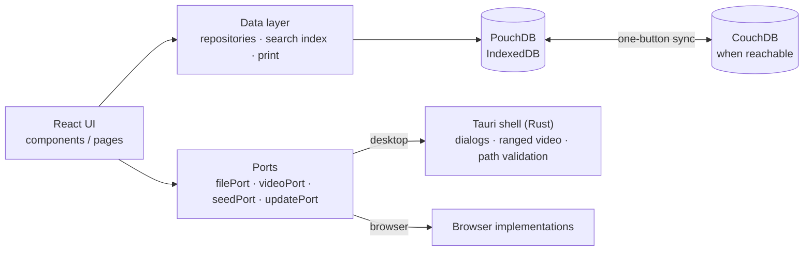

- `src/data/` — the data layer: PouchDB repositories, replication, export and
  import streams, the seed pipeline, the search index, the PDF generator. No
  React imports here.
- `src/components/`, `src/pages/` — UI. **No direct Tauri imports anywhere**:
  everything platform-specific goes through the ports, with browser and Tauri
  implementations. The whole app runs as an ordinary website, which is what
  makes it testable.
- `src-tauri/` — the Rust shell: window, CSP, native dialogs, ranged video
  serving, and path validation for every file name that arrives from the
  database (a database that travels between machines can arrive corrupted).
- Tests: 743 across 62 files — unit and integration suites over the data layer
  (including replication against a live CouchDB via `AURORA_COUCH_URL` and the
  PDF generator verified through pdf.js itself), plus pure-logic tests for the
  UI decisions that matter: key handling, formatting, print layout, figure
  binding, palette contrast.

## Quick start

```bash
npm install
npm run dev          # browser build with the demo handbook at :1420
npm run tauri dev    # desktop shell
npm test             # vitest
npm run tauri build  # Windows installer
```

On first run the app seeds the demo handbook: 10 sections, 44 materials —
protocols, generated forms, slide decks, two film sessions — with three demo
accounts (`alex` — consultant, `sam` — senior consultant, `robin` — programme
director; password `aurora`). Six demo clips in `public/videos/` are already
attached to protocols and films and play in the browser build; for the desktop
build, copy them into a `videos/` folder next to the executable.

To try sync, point the sync panel at any CouchDB 3.x with CORS enabled for
`http://tauri.localhost` and `http://localhost:1420`.

## License

**Source-available, not open source.** You are welcome to read the code, run
it locally and learn from it. Any production use — commercial, non-profit or
otherwise — and any redistribution require the author's prior written
consent: open an issue to ask. See [LICENSE](LICENSE) for the exact terms.
